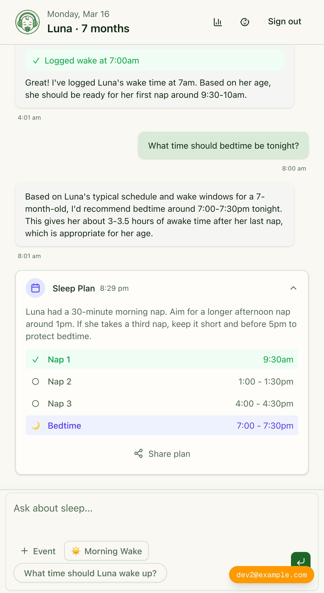
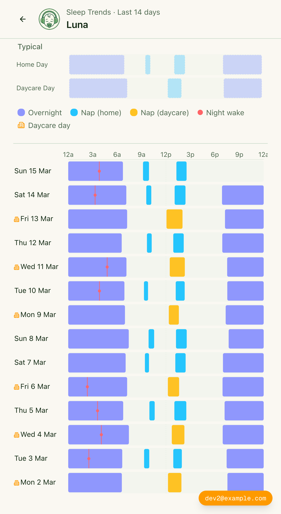

# Nappster

A Progressive Web App for tracking baby sleep with AI-powered schedule recommendations. Built to replace ad-hoc ChatGPT conversations with a purpose-built experience that multiple caregivers can share.

## Screenshots

<p align="center">
  
  &nbsp;&nbsp;&nbsp;&nbsp;
  
</p>

**Left:** AI chat interface — log events, ask questions, and get a generated sleep plan with recommended nap times and bedtime. **Right:** Sleep trends view — visualize 14 days of sleep patterns across home and daycare contexts.

## Features

- **Quick Entry UI** - Large tap targets for one-handed use while holding a baby
- **AI Sleep Plans** - Automatically generates next nap/bedtime recommendations based on logged events
- **AI Chat with Tools** - Ask questions and the AI can read history, log events, and update your baby's sleep patterns
- **Real-time Family Sync** - Multiple caregivers see updates instantly via Supabase Realtime
- **Mobile-First PWA** - Optimized for phones with offline-capable architecture

## Tech Stack

| Layer | Technology |
|-------|------------|
| Framework | Next.js 16 (App Router) |
| Language | TypeScript 5 (strict mode) |
| AI | Vercel AI SDK 6 + OpenAI GPT-5.2 |
| Styling | Tailwind CSS 4 + shadcn/ui |
| Database | Supabase (PostgreSQL + Realtime) |
| Auth | Supabase Auth with RLS |

## Getting Started

### Option 1: Local Development with Mock Data

The fastest way to get started - no external services required:

```bash
# Clone and install
git clone <repo-url>
cd nappster
npm install

# Enable mock mode
echo "NEXT_PUBLIC_USE_MOCK_DATA=true" >> .env.local
echo "OPENAI_API_KEY=sk-your-key" >> .env.local

# Start development server
npm run dev
```

Mock mode provides:
- Auto-authenticated user (`dev@example.com`)
- Sample baby "Luna" (~7 months old)
- Dynamically generated sleep events based on current time
- Full CRUD operations (resets on refresh)

### Option 2: Full Setup with Supabase

1. **Create Supabase Project**
   - Go to [supabase.com](https://supabase.com) and create a new project
   - Run the schema from `supabase-schema.sql` in the SQL Editor

2. **Configure Environment**
   ```bash
   cp .env.local.example .env.local
   ```

   Fill in your values:
   ```bash
   NEXT_PUBLIC_SUPABASE_URL=https://your-project.supabase.co
   NEXT_PUBLIC_SUPABASE_ANON_KEY=your-anon-key
   OPENAI_API_KEY=sk-your-key
   ```

3. **Install and Run**
   ```bash
   npm install
   npm run dev
   ```

Open [http://localhost:3000](http://localhost:3000) to see the app.

## Project Structure

```
src/
├── app/                          # Next.js App Router
│   ├── page.tsx                  # Main dashboard
│   ├── auth/                     # Login, signup, OAuth callback
│   ├── onboarding/               # Baby profile setup
│   ├── settings/                 # User preferences
│   └── api/
│       ├── chat/                 # AI chat with tool calling
│       │   ├── route.ts          # Streaming chat endpoint
│       │   └── messages/         # Chat history pagination
│       └── sleep-plan/           # Sleep schedule generation
│
├── components/
│   ├── ui/                       # shadcn/ui components
│   ├── ai-elements/              # Chat UI components
│   ├── chat-content.tsx          # Main chat interface
│   ├── sleep-event-dialog.tsx    # Event editor
│   └── sleep-session-dialog.tsx  # Paired event editor
│
├── lib/
│   ├── ai/tools/                 # AI tool definitions
│   ├── supabase/                 # Database client factories
│   ├── mock/                     # In-memory mock for dev
│   ├── hooks/                    # Custom React hooks
│   └── sleep-utils.ts            # Time/event utilities
│
└── types/
    └── database.ts               # TypeScript types
```

## Usage Flow

1. **Sign up** - Create an account with email/password
2. **Onboarding** - Enter baby's name, birthdate, and sleep notes
3. **Log wake time** - Start the day by logging when baby woke
4. **Log naps** - Tap "Nap Started" and "Nap Ended" throughout the day
5. **View recommendations** - AI generates a schedule based on logged events
6. **Ask questions** - Chat for edge cases like "She had a car nap, what now?"

## AI Capabilities

The AI assistant can:
- **Read context** - Baby profile, today's events, sleep history, past conversations
- **Log events** - Create sleep events on your behalf via natural language
- **Update patterns** - Save notes about your baby's sleep patterns
- **Generate schedules** - Create structured daily sleep plans

## Scripts

```bash
npm run dev      # Start development server
npm run build    # Production build
npm run start    # Start production server
npm run lint     # Run ESLint
```

## Deployment

### Vercel (Recommended)

1. Push to GitHub
2. Import to Vercel
3. Add environment variables:
   - `NEXT_PUBLIC_SUPABASE_URL`
   - `NEXT_PUBLIC_SUPABASE_ANON_KEY`
   - `OPENAI_API_KEY`
4. Deploy

## Documentation

- [CLAUDE.md](CLAUDE.md) - AI assistant guidance for code modifications
- [docs/ARCHITECTURE.md](docs/ARCHITECTURE.md) - Detailed system architecture

## License

MIT
