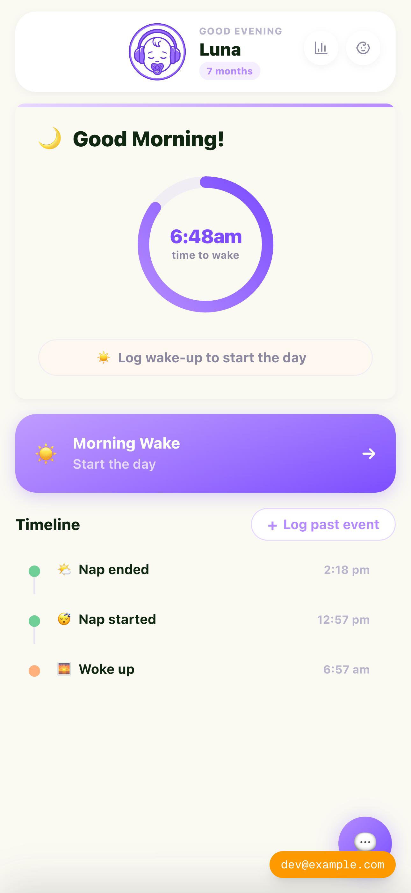
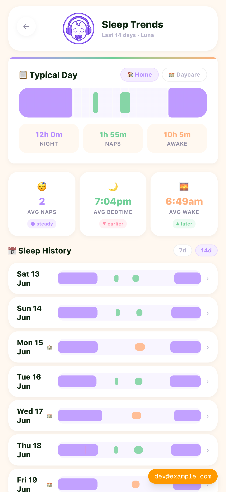

# Nappster


A Progressive Web App for tracking baby sleep with AI-powered schedule recommendations. Built to replace ad-hoc ChatGPT conversations with a purpose-built experience that multiple caregivers can share.

## Screenshots

<p align="center">
  
  &nbsp;&nbsp;&nbsp;&nbsp;
  
</p>

**Left:** Sleep dashboard — a state-aware hero card with a countdown ring, contextual quick-action buttons, and a scrolling day timeline. AI sleep coach lives in a swipe-up chat drawer. **Right:** Sleep trends view — a "Typical Day" summary across home/daycare contexts, average-day stat cards, and 7/14-day history bars with tappable day detail.

## Features

- **State-Aware Dashboard** - The app computes a deterministic sleep state (`awaiting_morning_wake`, `overnight_sleep`, `daytime_awake`, `daytime_napping`) from logged events and shows a matching hero card with a live countdown ring and only the quick actions that make sense for the current state.
- **Quick Entry UI** - Large tap targets for one-handed use while holding a baby. Tap once to log an event instantly, or open the EventSheet to backfill a time, context, or notes.
- **AI Sleep Coach (drawer)** - A swipe-up chat drawer with tool-calling AI (GPT-5.2) that reads baby history, logs events, updates pattern notes, and generates structured sleep plans. The chat stays out of the way until you need it.
- **Sleep Trends** - A dedicated `/sleep-trends` page visualizes a "Typical Day" (night/naps/awake split) for home and daycare contexts, average-day stat cards (avg naps, bedtime, wake), and 7/14-day history bars with a tappable day-detail sheet.
- **Real-time Family Sync** - Multiple caregivers see updates instantly via Supabase Realtime, and new caregivers join with a 6-digit invite code generated from Settings.
- **Mobile-First PWA** - Optimized for phones with a Serwist service worker for offline-capable architecture, web app manifest, and installable icons.

## Tech Stack

| Layer | Technology |
|-------|------------|
| Framework | Next.js 16 (App Router) |
| Language | TypeScript 5.9 (strict mode) |
| UI | React 19 + Tailwind CSS 4 + shadcn/ui |
| Animation | Motion |
| AI | Vercel AI SDK 6 + OpenAI GPT-5.2 (tool calling, reasoning) |
| Database | Supabase (PostgreSQL + Auth + Realtime + RLS) |
| PWA | Serwist 9 (service worker, precaching, runtime caching) |
| Testing | Vitest + Testing Library |

## Getting Started

### Option 1: Local Development with Mock Data

The fastest way to get started - no external services required:

```bash
# Clone and install
git clone <repo-url>
cd nappster
npm install

# Enable mock mode
echo "NEXT_PUBLIC_USE_MOCK_DATA=true" >> .env.local
echo "OPENAI_API_KEY=sk-your-key" >> .env.local

# Start development server
npm run dev
```

Mock mode provides:
- Auto-authenticated user (`dev@example.com`)
- Sample baby "Luna" (~7 months old)
- Dynamically generated sleep events based on current time
- Full CRUD operations (resets on refresh)
- A second caregiver (`dev2@example.com`) for testing family sync

### Option 2: Full Setup with Supabase

1. **Create Supabase Project**
   - Go to [supabase.com](https://supabase.com) and create a new project
   - Run the schema from `supabase-schema.sql` in the SQL Editor

2. **Configure Environment**
   ```bash
   cp .env.local.example .env.local
   ```

   Fill in your values:
   ```bash
   NEXT_PUBLIC_SUPABASE_URL=https://your-project.supabase.co
   NEXT_PUBLIC_SUPABASE_ANON_KEY=your-anon-key
   OPENAI_API_KEY=sk-your-key
   ```

3. **Install and Run**
   ```bash
   npm install
   npm run dev
   ```

Open [http://localhost:3000](http://localhost:3000) to see the app.

## Project Structure

```
src/
├── app/                          # Next.js App Router
│   ├── page.tsx                  # Main dashboard (server component)
│   ├── sleep-trends/page.tsx     # 14-day trends + typical-day view
│   ├── auth/                     # Login, signup, OAuth callback
│   ├── onboarding/               # Baby profile setup
│   ├── settings/                 # User prefs, caregivers, invite codes
│   ├── error.tsx                 # Error boundary
│   ├── sw.ts                     # Serwist service worker entry
│   └── api/
│       ├── chat/                 # AI chat (streaming + tool calling)
│       │   ├── route.ts          # Streaming chat endpoint
│       │   └── messages/         # Chat history pagination
│       ├── sleep-plan/[babyId]/  # Fetch active sleep plan (GET)
│       └── invite/               # Caregiver invite codes + redemption
│
├── components/
│   ├── ui/                       # shadcn/ui primitives
│   ├── ai-elements/              # Chat UI components (conversation, message, reasoning, chain-of-thought)
│   ├── sleep/                    # Dashboard composition
│   │   ├── sleep-dashboard.tsx   # State-driven dashboard shell
│   │   ├── state-hero.tsx        # Countdown-ring hero card
│   │   ├── countdown-ring.tsx    # Circular progress ring
│   │   ├── action-buttons.tsx    # Primary/secondary quick actions
│   │   ├── timeline-section.tsx  # Grouped day timeline
│   │   ├── event-sheet.tsx       # Bottom-sheet create/edit event
│   │   ├── chat-drawer.tsx       # Swipe-up AI chat drawer + FAB
│   │   ├── trends-view.tsx       # Typical-day + history trends UI
│   │   └── page-header.tsx       # Shared rounded-card header
│   ├── chat-content.tsx          # Main page client component (wires dashboard + chat)
│   ├── app-header.tsx            # Dashboard header (trends + settings nav)
│   ├── nappster-logo.tsx         # Brand logo
│   ├── settings-form.tsx         # Profile + caregiver + invite management
│   └── service-worker-register.tsx
│
├── lib/
│   ├── ai/                       # Prompts, schemas, tools
│   │   ├── tools/                # 7 tool factories (read + write)
│   │   ├── prompts.ts            # System prompt builder
│   │   └── schemas/sleep-plan.ts # Zod schema for AI plan output
│   ├── services/                 # Typed data-access layer (no raw supabase.from outside this)
│   ├── supabase/                 # Server + client client factories
│   ├── mock/                     # In-memory mock for dev
│   ├── hooks/                    # Realtime sync, CRUD, tool outputs, etc.
│   ├── api/                      # API route helpers (auth, validation, responses)
│   ├── state-machine.ts          # Deterministic sleep-state computation
│   ├── sleep-utils.ts            # Event grouping / formatting
│   ├── sleep-trends.ts           # Trends day-row + typical-day builder
│   ├── sleep-trend-stats.ts      # Aggregate trend stats
│   ├── merge-data.ts             # Merge initial/local/realtime/refresh streams
│   ├── timezone.ts               # Timezone utilities (date-fns-tz)
│   ├── env.ts                    # Environment validation
│   └── error-reporting.ts        # Configurable error reporting
│
├── types/
│   └── database.ts               # TypeScript types (incl. Context, SleepState invite_codes)
│
└── proxy.ts                      # Auth middleware (supabase-ssr)
```

## App Tour

1. **Landing → Sign up** - Logged-out visitors see a branded landing page with "Get Started".
2. **Onboarding** - Enter baby's name and birthdate to create a baby profile and link via `family_members`.
3. **Dashboard** - The state hero shows where baby is now (e.g. "Taking a Nap") with a countdown to the next expected transition. Contextual action buttons let you log the next event in one tap.
4. **Timeline** - Below the hero, today's events render as a grouped, editable timeline. Tap an entry to edit, or use "+" to backfill an event via the EventSheet.
5. **AI coach drawer** - Tap the 💬 FAB to open the chat drawer. Ask edge-case questions ("She had a car nap, what now?") and the AI can read history, log events, update pattern notes, and save a structured sleep plan.
6. **Sleep Trends** - Tap the chart icon in the header to open `/sleep-trends` for a 7- or 14-day view, a Typical Day summary (home vs daycare), and average-day stats.
7. **Settings** - Tap the profile icon to manage baby profile, view connected caregivers, and generate a 6-digit invite code so a partner/caregiver can join.

## AI Capabilities

The AI assistant uses tool calling to fetch data on demand rather than receiving pre-injected context:

- **Read context** - `getBabyProfile`, `getTodayEvents`, `getSleepHistory`, `getChatHistory`
- **Log events** - `createSleepEvent` (wake, nap_start, nap_end, bedtime, night_wake)
- **Update patterns** - `updatePatternNotes` saves notes about your baby's sleep patterns
- **Generate schedules** - `updateSleepPlan` writes a structured daily plan (current state, next action, schedule, target bedtime, summary) with an `events_hash` used for cache invalidation

Sleep plans are generated by the AI during chat (via `updateSleepPlan`), not through a separate generation endpoint. `GET /api/sleep-plan/[babyId]` fetches the active plan and checks staleness against current events.

## Scripts

```bash
npm run dev            # Start development server
npm run build          # Production build (webpack)
npm run start          # Start production server
npm run lint           # Run ESLint
npm run test           # Run Vitest suite
npm run test:watch     # Run Vitest in watch mode
npm run test:coverage   # Run tests with coverage report
```

## Deployment

### Vercel (Recommended)

1. Push to GitHub
2. Import to Vercel
3. Add environment variables:
   - `NEXT_PUBLIC_SUPABASE_URL`
   - `NEXT_PUBLIC_SUPABASE_ANON_KEY`
   - `OPENAI_API_KEY`
4. Deploy

## Documentation

- [CLAUDE.md](CLAUDE.md) - AI assistant guidance for code modifications
- [docs/ARCHITECTURE.md](docs/ARCHITECTURE.md) - Detailed system architecture
- [docs/adr/](docs/adr/) - Architecture Decision Records (tool-based AI, events-hash cache, broadcast-delete workaround, mock mode, service layer)

## License

MIT
